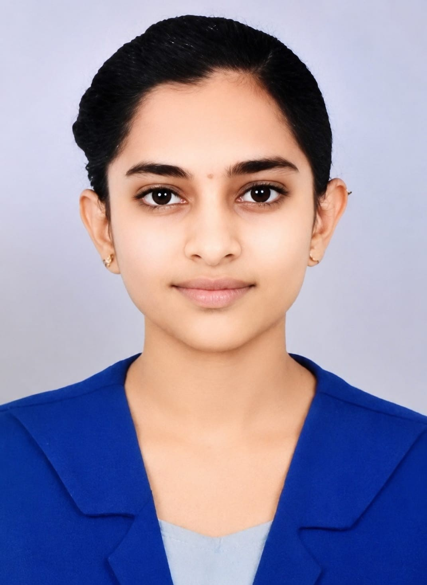



 

<h2>Electronics & Communication Engineering</h2>

AI/ML &nbsp; | &nbsp; Embedded Systems &nbsp; | &nbsp; VLSI

---

## ENGINEERING PROFILE

<table>
<tr>
<td align="center" width="25%">

### AI / ML

Machine Learning 
Computer Vision 
TensorFlow 
Scikit-learn

</td>
<td align="center" width="25%">

### EMBEDDED

ESP32 
IoT 
Embedded Systems 
Hardware Integration

</td>
<td align="center" width="25%">

### VLSI

Verilog HDL 
RTL Design 
Digital Design 
Cadence Virtuoso

</td>
<td align="center" width="25%">

### SOFTWARE

C / C++ 
Python 
Java 
JavaScript

</td>
</tr>
</table>

---

## TECHNICAL STACK

  

---

## SELECTED PROJECTS

<table>
<tr>
<td width="50%" valign="top">

<h3>Secure Gemini Journal</h3>

Secure AI-powered journaling platform built with Gemini and Firebase, with authenticated user data isolation and cloud deployment.

  

  

<a href="https://github.com/snehassneha4578-collab/secure-gemini-journal">
View Repository
</a>

</td>

<td width="50%" valign="top">

<h3>6G Smart Factory ML</h3>

Machine-learning project analysing the relationship between 6G network performance and manufacturing efficiency in smart factories.

  

 

Python · Pandas · Scikit-learn · Streamlit

  

<a href="https://github.com/snehassneha4578-collab/Project-Impact-of-6G-Network-Performance-on-Manufacturing-Efficiency-in-Smart-Factories">
View Repository
</a>

</td>
</tr>

<tr>
<td width="50%" valign="top">

<h3>VISUALIQ</h3>

AI-powered visual commerce platform for analysing and scoring product images using computer vision and generative AI.

  

 

Gemini · Cloudinary · AWS · Computer Vision

  

<a href="https://github.com/snehassneha4578-collab/VISUALIQ-AI-Powered-Product-Intelligence">
View Repository
</a>

</td>

<td width="50%" valign="top">

<h3>AI Hand Gesture Automation</h3>

Computer-vision based gesture recognition system designed for presentation automation and hands-free interaction.

  

  

<a href="https://github.com/snehassneha4578-collab/AI-Hand-Gesture-Presentation-Automation">
View Repository
</a>

</td>
</tr>
</table>

---

## ENGINEERING JOURNEY

---

## EDUCATION

**B.E. Electronics & Communication Engineering**

UBDT College of Engineering, Davanagere  
Visvesvaraya Technological University

**2023 — 2027**  
**CGPA: 8.6 / 10**

---

## CERTIFICATIONS & EXPERIENCE

| Area | Experience |
|---|---|
| AI / ML | Unified Mentor ML Internship |
| VLSI | NPTEL Embedded Sensing, Actuation and Interfacing Systems |
| Embedded | NPTEL Embedded Systems |
| Generative AI | Intellipaat AI Bootcamp |
| GenAI | SkillQuest GenAI Literacy |

---

## GITHUB ACTIVITY

  

---

### SNEHA S

Electronics & Communication Engineering  
AI/ML · Embedded Systems · VLSI

<a href="https://github.com/snehassneha4578-collab">GitHub</a>
&nbsp;&nbsp;&nbsp;
<a href="https://www.linkedin.com/in/sneha-s-59b8ab355">LinkedIn</a>
&nbsp;&nbsp;&nbsp;
<a href="https://devpost.com/snehassneha4578">Devpost</a>

---

## GITHUB PROFILE

  

Currently active across multiple repositories in AI/ML, programming practice, embedded systems, computer vision and engineering projects.

## GitHub Activity

  

