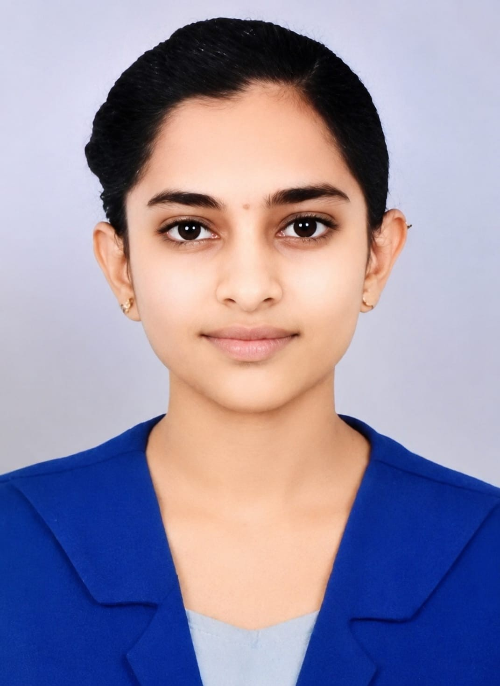

<!-- ===================================================== -->

<!-- LARGE PROFILE PHOTO -->

<!-- Put profile.jpg in the same repository as README.md -->

<!-- ===================================================== -->

  

<!-- ===================================================== -->

<!-- ANIMATED FUTURISTIC ENGINEERING HEADER -->

<!-- ===================================================== -->

 

---

## ENGINEERING FOCUS

<table>
<tr>

<td align="center" width="25%">

### 🤖 AI / ML

Computer Vision
TensorFlow
Scikit-learn
Pandas

</td>

<td align="center" width="25%">

### 🔌 EMBEDDED

ESP32
IoT
Embedded Systems
Hardware Integration

</td>

<td align="center" width="25%">

### 🧬 VLSI

Verilog HDL
RTL Design
Digital Design
Cadence Virtuoso

</td>

<td align="center" width="25%">

### 💻 SOFTWARE

C / C++
Python
Java
JavaScript

</td>

</tr>
</table>

---

## TECHNICAL STACK

### 💻 Programming

  

### 🤖 AI / ML

  

### 🔌 Embedded & IoT

  

### 🧬 VLSI & Digital Design

  

### ☁️ Development Tools

---

## SELECTED PROJECTS

### 🔐 Secure Gemini Journal

Secure AI-powered journaling platform built with Gemini and Firebase, featuring authenticated user data isolation and cloud deployment.

  

  

---

### 🏭 6G Smart Factory ML

Machine-learning project analysing the relationship between 6G network performance and manufacturing efficiency in smart factories.

**Python · Pandas · Scikit-learn · Streamlit**

  

  

---

### 👁️ VISUALIQ

AI-powered product intelligence and visual commerce platform combining computer vision, generative AI and cloud-based product analysis.

**Gemini · Cloudinary · AWS · Computer Vision**

  

---

### ✋ AI Hand Gesture Automation

Computer-vision based gesture recognition system designed for presentation automation and hands-free interaction.

  

  

---

## ENGINEERING JOURNEY

  

💡 **Curiosity**

  →  

📚 **Learning**

  →  

⚙️ **Building**

  →  

🚀 **Innovation**

  →  

🌍 **Impact**

---

## EDUCATION

### 🎓 B.E. Electronics & Communication Engineering

**UBDT College of Engineering, Davanagere**

Visvesvaraya Technological University

**2023 — 2027**

 

---

## CERTIFICATIONS & EXPERIENCE

| **Area**            | **Experience**               |
| ------------------- | ---------------------------- |
| 🤖 AI / ML          | Unified Mentor ML Internship |
| 🔌 Embedded Systems | NPTEL Embedded Systems       |
| 🧠 Generative AI    | Intellipaat AI Bootcamp      |
| ✨ GenAI             | SkillQuest GenAI Literacy    |

---

## GITHUB ACTIVITY

  

---

## GITHUB PROFILE

  

  

<i>Currently active across AI/ML, programming, embedded systems, computer vision, VLSI and engineering projects.</i>

---

## POPULAR REPOSITORIES

1. **Java-Practice-** — Java programming practice
2. **Cpp-Practice** — C++ programming practice
3. **Python-Practice** — Python programming practice
4. **snehassneha4578-collab.github.io** — Personal portfolio
5. **Project-Impact-of-6G-Network-Performance-on-Manufacturing-Efficiency-in-Smart-Factories** — 6G Smart Factory Network Analysis & Machine Learning
6. **secure-gemini-journal** — Secure Gemini AI Journal

---

 

  

### 💜 Electronics Engineer in Progress

**AI/ML • Embedded Systems • VLSI • Software**

